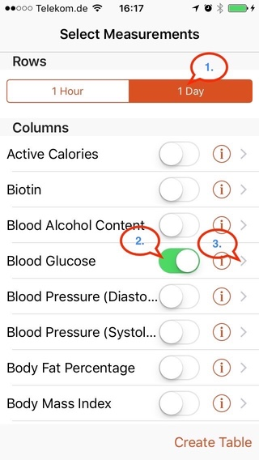
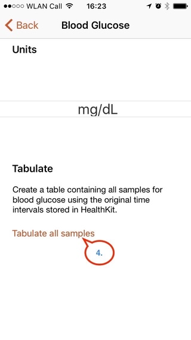
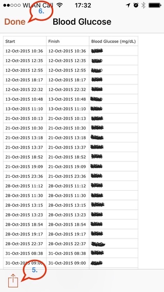

# bzreport – Blutzucker-Report

## Beschreibung
Das Programm `bzreport` wandelt die Blutzucker-Werte, die durch die iOS-Applikation _Health_ von Apple[^1] gesammelt und durch _QS-Access_ von Quantified Self Lebs[^2] exportiert worden sind, in eine CSV-Datei um, die folgendes Format aufweist:

|Datum     |Uhrzeit|Blutzuckerwert (mg/dL)|
|:---------|:------|---------------------:|
|01.01.2000|13:42  | 100                  |
| …        | …     | …                    |

Die so erzeugte CSV-Datei kann man dann an seinen Diabetologen senden oder für eigene Zwecke weiter verarbeiten. Ersteres ist dann sinnvoll und notwendig, falls das eigene Blutzucker-Messgerät nicht vom Arzt ausgelesen werden kann oder man kein Tagebuch aus toten Bäumen führen möchte.


## Installation
Zum Ausführen des Programms wird Python 3[^3] benötigt.
```bash
    $ git clone https://github.com/mean-old-man/bzreport.git
    $ cp bzreport/bzreport.py /usr/local/bin
    $ chmod 755 /usr/local/bin/bzreporty
```


## Aufruf

```bash
    # Alle Daten umwandelen
    $ bzreport -i 'Blood Glucose.csv' -o Blutzuckerwerte.csv

    # Nur Daten ab einem Datum (hier 01.04.2017) umwandeln
    $ bzreport -i 'Blood Glucose.csv' -d '01.04.2017' -o BZW_ab_2017-04-01.csv
```


## Benutzung
Zuerst werden mithilfe der App _QS-Access_ die Blutzuckerwerte exportiert.

1. Den Zeitraum _1 Day_ auswählen.
2. Den Spalte _Blood Glucose_ aktivieren.
3. Durch Berühren des _Info-Icons_ weitere Informationen aufrufen .
4. Durch Berühren von _Tabulate all samples_ die Tabelle mit allen Blutzuckerwerten erzeugen.
5. Die erzeugte Tabelle exportieren – es wird eine CSV-Datei mit Namen _Blood Glucose.csv_ erzeugt.
6. QS-Access beenden.
7. `bzreport` ausführen.
8. Die durch bzreport.py erzeugte CSV-Datei weiter verarbeiten.
9. Fertig.

<!-- Screenshot 1 (Zeigt die Schritte #1 bis #3.) -->
<!-- Screenshot 2 (Zeigt den Schritt #4.) -->
<!-- Screenshot 1 (Zeigt die Schritte #5 und #6.) -->
  


## Lizenz

MIT License

Copyright (c) 2017 Olaf Heinemann

Permission is hereby granted, free of charge, to any person obtaining a copy
of this software and associated documentation files (the "Software"), to deal
in the Software without restriction, including without limitation the rights
to use, copy, modify, merge, publish, distribute, sublicense, and/or sell
copies of the Software, and to permit persons to whom the Software is
furnished to do so, subject to the following conditions:

The above copyright notice and this permission notice shall be included in all
copies or substantial portions of the Software.

THE SOFTWARE IS PROVIDED "AS IS", WITHOUT WARRANTY OF ANY KIND, EXPRESS OR
IMPLIED, INCLUDING BUT NOT LIMITED TO THE WARRANTIES OF MERCHANTABILITY,
FITNESS FOR A PARTICULAR PURPOSE AND NONINFRINGEMENT. IN NO EVENT SHALL THE
AUTHORS OR COPYRIGHT HOLDERS BE LIABLE FOR ANY CLAIM, DAMAGES OR OTHER
LIABILITY, WHETHER IN AN ACTION OF CONTRACT, TORT OR OTHERWISE, ARISING FROM,
OUT OF OR IN CONNECTION WITH THE SOFTWARE OR THE USE OR OTHER DEALINGS IN THE
SOFTWARE.


[^1]:	[Apple Health](https://www.apple.com/de/ios/health/)
[^2]:	[QS-Access](https://itunes.apple.com/de/app/qs-access/id920297614?mt=8)
[^3]:   [Python Software Foundation](https://www.python.org)
